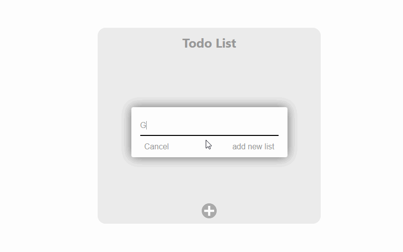

# TODO APP

A simple Todo App using React.js and Node.js	



### PREREQUISITE
Install Node.js

Install MongoDB with default URL Setting

### INSTRUCTIONS
Clone this repository.

```
https://github.com/norman-chifenga/Todo-App
```

Config dotenv file, replace the database URL
```
DATABASE_URL = "mongodb://127.0.0.1:27017/todoApp"
```

Install dependencies
```
npm install
```

To start both the express Server and Client app, run the following.
```
npm run dev
```

